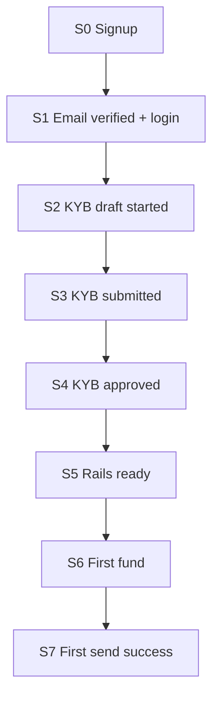

# Mboka B2B onboarding QA — register → first transaction

**Branch:** `docs/onboarding-qa-register-to-first-txn`  
**Date:** 2026-08-30  
**Scope:** Business dashboard path only (not mobile consumer KYC)  
**Codebases:** B2BDASHBOARD + Mboka-Backend (`main`)  
**Activation readiness score:** **4.5 / 10**

---

## Executive summary

Mboka’s engineered happy path is sound on paper:

**signup → email verify → login → customer-vault KYB → approve → open IBAN/USDC → fund → OffRamp or Phase-4 send.**

Money CTAs and IBAN issuance are correctly hard-gated on KYB `approved`. That avoids the “charges_enabled while still pending” Stripe Connect trap.

Where we **repeat industry failure patterns** is after submit and after approve:

1. **Opaque “In review”** — post-submit poll is ~0.8s; approval is webhook-only with weak in-app refresh.
2. **Empty approved dashboard** — no Fund → first-send mission; accounts are manual open; home has no “open/fund” empty CTA.
3. **Late country** — signup defaults business country to `KE`, skewing vault document packs.
4. **Fake Team surface** — backend invites are live; FE Team is mock demo data.
5. **Capability landmine** — `business.kyb_verified` is never set in production paths (seed scripts only).

Industry benchmark (Stripe Connect deferred KYB, Mercury/Brex activation, Bridge rail provisioning, Paystack/Flutterwave doc clarity): best-in-class 2025–26 products **explore early, verify at money intent, auto-provision rails on approval, and scaffold first fund→send**. We are strong on hard money gates and weak on activation scaffolding.

**North-star:** S0 → S7 (signup → first successful outbound).  
**Secondary:** S4 → S7 (approve → first send) — this is where we lose users today.

---

## Funnel map



| Stage | Start | Success end | Do not count as success |
|-------|--------|-------------|-------------------------|
| **S0** Signup | Account created | Can reach verify-email | Email sent only |
| **S1** Auth | Signup | Email verified + login session | Soft browse without session |
| **S2** KYB started | First profile save | Draft exists | Opened Verification screen only |
| **S3** KYB submitted | User hits Submit | Status `submitted` | Fields filled, not submitted |
| **S4** KYB approved | Submitted | Profile `approved` **and** money APIs allow deposit/send | Docs uploaded only |
| **S5** Rails ready | Approved | ≥1 ready IBAN **or** ready USDC account **visible in UI** | Backend row exists, UI empty |
| **S6** First fund | Rails ready | Inbound credit on ledger (order / IBAN / `acr_*`) | Instructions copied |
| **S7** First send | Funded | Terminal success OffRamp **or** account-send | Quote created / failed send |

### Path as implemented

| # | Step | FE | API |
|---|------|----|-----|
| 1 | Signup | `/signup` | `POST /api/auth/businesses/signup` |
| 2 | Verify | `/verify-email` | `POST /api/auth/verify-email` |
| 3 | Login | `/login` | `POST /api/auth/businesses/login` + cookies |
| 4 | Shell | `/dashboard` + `GET /v1/bootstrap` | `GET /api/auth/me` |
| 5 | KYB | Wizard modal / Verification | vault profile → initiate → docs → submit → poll |
| 6 | Open accounts | Accounts screen | `POST /v1/iban/accounts`, `POST /v1/entities/{id}/accounts` |
| 7 | Fund | Deposit / Receive / Fund chooser | OnRamp quote+accept, IBAN, crypto receive |
| 8 | Send | Send modal | OffRamp orders **or** `…/sends/preview` + confirm |

Key FE: [`components/DashboardApp.tsx`](../../components/DashboardApp.tsx), [`lib/hooks/useKybWizard.ts`](../../lib/hooks/useKybWizard.ts), [`lib/services/kyb.ts`](../../lib/services/kyb.ts)  
Key BE: `app/controllers/auth.py`, `kyb.py`, `bootstrap.py`, `deposit_accounts.py`, `entities.py`, `sends.py`, `orders.py`, `transactions.py`, `account_credits.py`

---

## Industry anti-pattern → Mboka evidence

| Industry anti-pattern | Who fails this way | Mboka evidence | Severity | Verdict |
|----------------------|--------------------|----------------|----------|---------|
| Full KYB before any product value | Stripe Connect default; many African PSPs | Money CTAs gated (good); little corridor/FX “explore” before KYB | Medium | Partial pass |
| Opaque pending / “in review” | Everywhere | `POST_SUBMIT_POLL_ATTEMPTS=3`, `DELAY=400ms` (~0.8s); stuck `submitted` still shows success “In review”; wizard cannot reopen while submitted | **P0** | Fail |
| Empty approved dashboard | Neo-bank / PSP activation killers | No post-approve Fund banner; home “Balance not yet available” + “No recent activity” without Open/Fund CTA | **P0** | Fail |
| Manual wallet create after approve | Weak onramps | Eligibility unlocks create; **no auto-provision** on `customer.approved` webhook | **P0** | Fail |
| Late geo / corridor surprise | Yellow Card, crypto onramps | Signup omits country; DB default `KE`; vault docs keyed off `business.country` | **P1** | Fail |
| Email-verify wall | Generic SaaS + some fintechs | Login hard-requires `email_verified` — no explore session | P1 | Fail (intentional but costly) |
| Team/invite before solo admin can act | Mid-market B2B | Solo admin OK; Team UI is **mock** while BE team APIs exist | **P1** | Fail (integrity) |
| Capability ≠ form status | Stripe `details_submitted` vs `charges_enabled` | Money gates use `profile.kyb_status` (good); `business.kyb_verified` **never set true** in app code | **P1** | Landmine |
| Document mismatch / no RFI | Flutterwave, Paystack, Circle | No `needs_info` status; `reviewer_notes` rarely written; rejected = reopen wizard only | **P1** | Fail |
| Dual provider / docs drift | Ops confusion | FE hardcodes `customer_vault`; Noah still in BE/schema/docs | P2 | Fail |
| Viewer sees write CTAs | RBAC UX bugs | `guardMoneyModal` checks KYB only, not role; viewer sees Send/Top up | **P1** | Fail |
| First-txn scaffolding missing | Bridge/Mercury winners avoid this | No Fund→Send mission; send soft-defaults to `COUNTRIES[0]` Kenya | **P0** | Fail |
| Sandbox vs live confusion | Flutterwave / developer PSPs | No permanent Live/Sandbox banner in dashboard | P2 | Fail |
| Inbound credit invisible | Crypto product traps | Credits merge into `/v1/transactions` when watcher on; watcher **flag-off by default** | P1 | Conditional |

**Directional industry targets (for future metrics):**

| Metric | Weak | Healthy | Strong |
|--------|------|---------|--------|
| S2→S4 boarding (self-serve) | &lt;30% | 35–55% | 55%+ |
| S4→S7 after approval | &lt;30% | 40–60% | 70%+ with scaffold |
| Approve → Fund CTA shown | &gt;24h | &lt;1h | Immediate (webhook) |
| Approve → first successful send | — | &lt;7d | &lt;48h with mission |

---

## Scorecard (pass / fail)

### Signup / explore

| Check | Result | Notes |
|-------|--------|-------|
| Unsupported country blocked before docs | **FAIL** | No country on signup; default KE |
| Entity type early | **FAIL** | Only in KYB step 1 as `business_type` |
| Browse product without full KYB | **PARTIAL** | Dashboard after login shows product chrome; money blocked |
| Email verify does not block all navigation | **FAIL** | Cannot login until verified |
| Solo admin can complete path without inviting teammate | **PASS** | Team not required |

### KYB

| Check | Result | Notes |
|-------|--------|-------|
| Country-specific “what you’ll need” before upload | **PARTIAL** | Vault requirements by corridor; wrong if country still KE |
| Wizard autosaves / resume | **PASS** | Draft profile + resume path in `useKybWizard` |
| Progress shows sections remaining | **PASS** | Multi-step wizard |
| Name-match preflight before submit | **FAIL** | No legal vs trading vs bank preflight |
| Rejected shows notes + resubmit | **PARTIAL** | Reopen + notes if present; notes often empty |
| RFI / needs-info in-app task | **FAIL** | Status enum has no `needs_info` |
| Never label approved until deposit/send capable | **PASS** (money) / **FAIL** (`kyb_verified`) | Profile status gates money; flag stale |
| Status refresh while submitted | **FAIL** | ~0.8s poll then static “In review” |

### Rails / wallet

| Check | Result | Notes |
|-------|--------|-------|
| On approval, rails appear without manual create | **FAIL** | Manual Create Account / open entity account |
| Crypto as balances/networks not seed phrases | **PASS** | Balance-first UX |
| Live/Sandbox unmistakable | **FAIL** | No mode banner |
| Entity lag after approve has clear UX | **FAIL** | “No partner entity linked — complete verification…” blames KYB |

### First transaction

| Check | Result | Notes |
|-------|--------|-------|
| Post-approval home CTA = Fund | **FAIL** | KYB banner disappears; no Fund strip |
| After first credit, CTA = Send (prefilled) | **FAIL** | No mission; soft Kenya default only |
| First-send failure copy + retry | **PARTIAL** | Modal errors exist; not onboarding-grade |
| Empty states always have one primary CTA | **FAIL** | Home/Wallets empties weak |
| Settlement / ETA communicated | **PARTIAL** | Account detail “Coordinates pending” OK; Receive fiat copy weak |
| Inbound Stellar visible as first fund | **CONDITIONAL** | Needs `ACCOUNT_CREDITS_WATCHER_ENABLED=true` + correct network label |

### Integrity

| Check | Result | Notes |
|-------|--------|-------|
| Team UI matches backend | **FAIL** | Mock FE vs live `app/routes/team.py` |
| Docs match vault path | **PARTIAL** | FE vault; Noah docs/ops drift |
| Roles disable write CTAs | **FAIL** | Viewer sees money tiles |
| Contract docs accurate on Team | **FAIL** | Historical “no backend” claim vs live APIs |

---

## Detailed findings (by stage)

### S0–S1 Auth

1. **[P1] Signup collects only name / email / password**  
   - FE: `app/signup/page.tsx` — no country, no entity type.  
   - BE: `SignupBusinessIn` optional `country`; model default `KE` (`app/models/business.py`).  
   - **Industry:** geo surprises after doc upload are a top African PSP abandon cause.

2. **[P1] Email verification blocks all product exploration**  
   - BE: `_authenticate_password` forbids unverified login (`app/controllers/auth.py`).  
   - **Industry:** explore-then-verify converts better; verify-before-browse is acceptable for money apps but should be paired with clear “what you’ll unlock” marketing on verify page.

3. **[P2] Work-email policy**  
   - Public domains blocked at signup — good for B2B quality; ensure error copy is explicit (Gmail users bounce without understanding).

### S2–S4 KYB

4. **[P0] Post-submit status UX is effectively “fire and forget”**  
   - `useKybWizard.ts`: 3 attempts × 400ms; continues to success UI if still `submitted`.  
   - `canOpenKybWizard`: false for `submitted` — user cannot reopen; money CTAs still gate to Verification with **no action**.  
   - **Industry:** opaque pending is the #1 support generator after KYB submit.

5. **[P1] No RFI / needs_info state machine**  
   - Enum: `pending | submitted | approved | rejected | expired` only.  
   - Rejected recovery = reopen wizard + optional `reviewer_notes`.  
   - Notes field is rarely populated from webhook sync.  
   - **Industry:** Circle/Connect RFI patterns — exact missing docs in-app, not email-only.

6. **[P1] `business.kyb_verified` never flips in production**  
   - `set_kyb_status` updates profile only; seed scripts set the column.  
   - Money path correctly uses `profile.kyb_status == approved` today.  
   - **Risk:** any future gate on `kyb_verified` silently breaks activation.

7. **[P2] Vault vs Noah drift**  
   - FE always `provider: "customer_vault"` (`lib/services/kyb.ts`).  
   - BE still supports Noah hosted; docs may still describe HostedURL flow.

### S4–S5 Rails

8. **[P0] No auto-provision on approval**  
   - Enrollment webhooks update KYB status; do not open IBAN or USDC accounts.  
   - User must discover Create Account / open stablecoin.  
   - **Industry:** Bridge/Mercury — approval → deposit instructions in face immediately.

9. **[P1] Entity resolve error blames verification**  
   - `resolvePrimaryEntityId` throws “complete business verification…” when entity list empty — misleading if KYB already approved (partner lag).

10. **[P2] IBAN pending UX uneven**  
    - Account detail: “Coordinates pending” (good).  
    - Receive modal: generic “No local receive account…” (weak).

### S5–S7 First money

11. **[P0] No guided Fund → Send mission**  
    - Multiple fund choosers (`FundChooserModal`, Deposit, Receive) without a single checklist.  
    - Home when approved + unfunded: balance empty + activity empty + money quick actions — no “Open an account” / “Fund your first balance”.

12. **[P1] First send not scaffolded**  
    - Soft default Kenya/`COUNTRIES[0]`; not business country / last corridor.  
    - Advanced fields not locked for first micro-send.

13. **[P1] Viewer role CTA mismatch**  
    - Backend RBAC: viewer has `money:read`, not `money:write`.  
    - FE: `guardMoneyModal` KYB-only; Send tiles visible → API fail.

14. **[P1] Team UI integrity**  
    - FE: session-local `TEAM_MEMBERS` + “simulated demo data”.  
    - BE: live invite/list/accept under `/api/businesses/.../members`.  
    - Compliance/ops risk: users think invites worked.

15. **[P1] Account-credits watcher off by default**  
    - Freighter/QR address-only deposits only become ElementPay rows when watcher enabled.  
    - Client Horizon poll helps if network label correct (`stellar_testnet` vs `Stellar`).

---

## Optimal target design (do not repeat industry mistakes)

One-line rule:

> **Let them see the money path first; ask for KYB when they try to move money; on approval, put deposit instructions and a first-send wizard in their face — never a quiet “verified” badge on an empty screen.**

### Recommended capability model

Drive UI from capabilities, not form strings alone:

| Capability | Means | Primary CTA |
|------------|-------|-------------|
| `can_explore` | Session exists | Tour corridors / start KYB |
| `can_edit_kyb` | `pending \| rejected \| expired` | Resume wizard |
| `can_wait_kyb` | `submitted` | ETA + email + refresh status |
| `needs_kyb_info` | RFI (new) | Exact missing docs |
| `can_deposit` | Approved + ≥1 ready rail | Fund / copy instructions |
| `can_send` | Funded (or credit available) + `money:write` | Send mission |
| `restricted` | Rejected / geo / risk | Notes + resubmit / waitlist |

### Recommended activation sequence (best-in-class)

1. **Signup screen 1:** country + entity type + soft eligibility / waitlist before password.  
2. **Explore mode:** corridors, indicative FX, “what you’ll get” deposit preview; KYB required at Deposit/Send/submit.  
3. **KYB:** country-specific prep pack; autosave (keep); name-match preflight; long-poll/SSE while submitted.  
4. **On `approved` webhook:** auto-open primary IBAN + primary USDC (product-chosen network); flip home to **Fund**.  
5. **First-send mission:** one corridor, micro-amount, locked advanced options, clear fee/ETA, failure + retry.  
6. **Team:** wire FE to BE or keep Preview until Tier 2 — never mock live invites.  
7. **Sync `business.kyb_verified`** with profile approval (or delete the column).  
8. **Permanent Live/Sandbox banner** when both environments exist.

---

## Prioritized backlog

### P0 — blocks S4→S7 or false “done”

| ID | Fix | Primary files |
|----|-----|---------------|
| P0-1 | KYB submitted: long-poll / bootstrap refresh / ETA; action on Verification while waiting | `useKybWizard.ts`, `DashboardApp.tsx`, `KybGateBanner.tsx` |
| P0-2 | Post-approval activation strip: Open account → Fund → First send | `DashboardApp.tsx`, new `ActivationChecklist` |
| P0-3 | Auto-provision rails on KYB approved webhook (or one-click “Issue accounts”) | `enrollment_webhooks.py` / `kyb.py`, deposit_accounts, entities |
| P0-4 | Home/Wallets empty states: single primary CTA when approved but unfunded / no accounts | `DashboardApp.tsx`, `WalletsScreen.tsx` |

### P1 — high abandon / support / integrity

| ID | Fix | Primary files |
|----|-----|---------------|
| P1-1 | Country (+ entity type) on signup; hard-stop unsupported geos | `app/signup/page.tsx`, `SignupBusinessIn` |
| P1-2 | RFI / `needs_info` + write `reviewer_notes` from sync/webhooks | enums, `kyb.py`, FE status UI |
| P1-3 | Set or remove `business.kyb_verified` | `repositories/kyb.py`, auth `/me` |
| P1-4 | Wire Team UI to `app/routes/team.py` **or** hard Preview label + disable invite | `DashboardApp.tsx`, new `teamApi` |
| P1-5 | Gate money CTAs by `money:write` (hide/disable for viewer) | `DashboardApp.tsx`, `auth.ts` |
| P1-6 | Fix entity-missing copy when KYB already approved | `entities.ts` |
| P1-7 | Document watcher enablement for environments that promise crypto deposit visibility | ops + `.env.example` |
| P1-8 | Soften or redesign email-verify wall with “unlock” framing + optional limited browse | auth + proxy product decision |

### P2 — polish / consistency

| ID | Fix |
|----|-----|
| P2-1 | Retire or quarantine Noah path in FE-facing docs |
| P2-2 | Live/Sandbox banner |
| P2-3 | Align Receive IBAN-pending copy with Account detail |
| P2-4 | Prefill first send from business country / last corridor |
| P2-5 | Name-match preflight before KYB submit |
| P2-6 | Update `docs/api-contract.md` Team section to match live APIs |

---

## Instrumentation (S0–S7 event schema)

Emit once per stage transition (idempotent on business_id + stage):

```ts
type OnboardingStage =
  | "s0_signup"
  | "s1_email_verified"
  | "s2_kyb_started"
  | "s3_kyb_submitted"
  | "s4_kyb_approved"
  | "s5_rails_ready"
  | "s6_first_fund"
  | "s7_first_send";

type OnboardingEvent = {
  stage: OnboardingStage;
  business_id: number;
  user_id: number;
  country?: string;
  entity_type?: string;
  rail?: "iban" | "usdc_stellar" | "usdc_base" | "usdc_polygon" | "onramp";
  environment: "sandbox" | "live" | "local";
  ts: string; // ISO
};
```

**Capability flags** (bootstrap or `/auth/me` extension):

```ts
type MoneyCapabilities = {
  can_edit_kyb: boolean;
  can_wait_kyb: boolean;
  needs_kyb_info: boolean;
  can_deposit: boolean;
  can_send: boolean;
  kyb_status: string;
  ready_rail_count: number;
  role: string;
  has_money_write: boolean;
};
```

Segment all funnel metrics by: country, entity type, acquisition channel, Live vs Sandbox.

---

## Suggested remediation phases (implementation — not in this branch)

| Phase | Outcome |
|-------|---------|
| **A — Status & empty states** | P0-1, P0-4, P1-6 — stop “stuck in review” and dead homes |
| **B — Activation** | P0-2, P0-3 — approve → rails → Fund CTA → first-send mission |
| **C — Integrity** | P1-3, P1-4, P1-5, P2-6 — flags, Team, roles, contract docs |
| **D — Intake & RFI** | P1-1, P1-2, P2-5 — country early, needs_info, name match |
| **E — Ops polish** | P1-7, P1-8, P2-1–P2-4 |

Do **not** implement in this docs branch without a separate product go-ahead.

---

## S0–S7 path-walk friction log

Method: code walk of B2BDASHBOARD + Mboka-Backend (`main` worktree) with line citations; prior local stack validation for S5–S6 Stellar credits. Full greenfield vault KYB submit against sandbox was **not** live-UAT’d (needs real docs).

### S0 Signup

| Friction | Severity | Evidence |
|----------|----------|----------|
| No country / entity type collected | High | FE `app/signup/page.tsx` state is only `businessName`, `email`, `password`, `confirmPassword`; `authApi.signup(businessName, email, password)` omits country |
| Business country defaults to `KE` | High | BE `app/models/business.py` — `country` `server_default="KE"` |
| Work-email domains only | Medium | BE signup policy `allow_public_domains=False` — personal Gmail fails without product explanation on FE |

**Dead-end:** Unsupported / non-KE business discovers wrong vault document pack only after KYB step 1.

### S1 Auth verified

| Friction | Severity | Evidence |
|----------|----------|----------|
| Unverified email cannot login | High (product choice) | BE `app/controllers/auth.py` L98–99 — `ForbiddenError("Email address is not verified.")` |
| No explore session without verify | Medium | FE `proxy.ts` only checks cookies; cookies only exist after verified login |
| `/me` exposes stale `kyb_verified` | High | BE `auth.py` L493 reads `biz.kyb_verified`; never flipped by `set_kyb_status` |

**Gate that works:** password policy + lockout on login.

### S2 KYB started

| Friction | Severity | Evidence |
|----------|----------|----------|
| Autosave / resume works | Pass | `lib/hooks/useKybWizard.ts` profile save + document resume |
| Docs corridor uses business country | Medium | BE KYB initiate uses `business.country` — still `KE` if signup omitted country |
| Entity type only here (not signup) | Medium | FE `KybWizardModal` “Business type” step |

### S3 KYB submitted

| Friction | Severity | Evidence |
|----------|----------|----------|
| Post-submit poll ~0.8s then stops | **Critical** | FE `useKybWizard.ts` L52–53: `POST_SUBMIT_POLL_ATTEMPTS = 3`, `POST_SUBMIT_POLL_DELAY_MS = 400` |
| Still-`submitted` shows success “In review” | **Critical** | Poll returns early only on `approved`/`rejected`; otherwise wizard still completes success path |
| Cannot reopen wizard while submitted | High | FE `lib/services/kyb.ts` L318–320 — `canOpenKybWizard` only `pending\|rejected\|expired` |
| Money CTA → Verification with **no action** | **Critical** | FE `DashboardApp.tsx` L1406–1414: if not approved, `goVerification()`; wizard opens only if `canOpenKybWizard` — false for `submitted`. Banner `showAction={canOpenKybWizard(...)}` at L3645 |

**Industry match:** opaque pending after submit — top Connect/PSP support driver.

### S4 KYB approved

| Friction | Severity | Evidence |
|----------|----------|----------|
| Profile status gates IBAN create | Pass | BE `deposit_accounts.py` L71–83 `_assert_verification_approved` requires `KybStatus.approved` |
| FE money gate uses profile status | Pass | FE `isKybApproved(kybStatus)` in `guardMoneyModal` / home tiles |
| `business.kyb_verified` never set true in app | High | BE `repositories/kyb.py` `set_kyb_status` L154–169 updates profile only; model docs claim flag drives access (`business.py` L31) |
| No RFI / `needs_info` | High | Status enum has no needs-info; rejected = reopen + optional empty `reviewer_notes` |
| Enrollment webhook updates status only | High | `enrollment_webhooks.py` maps approved → KYB status; does **not** open accounts |

### S5 Rails ready

| Friction | Severity | Evidence |
|----------|----------|----------|
| Accounts are **manual** open | **Critical** | FE Create Account → `depositAccountsApi.create` / `entitiesApi.openAccount`; eligibility unlocks create only |
| Empty entity list blames KYB | High | FE `lib/services/entities.ts` L68–75 — “complete business verification…” even when already approved |
| Wallets empty lacks inline CTA | Medium | `WalletsScreen` empty copy; CTA only in header |
| Home approved + no rails: no Open/Fund strip | **Critical** | FE L3644 banner only when `!kybApproved`; no post-approve activation checklist |
| IBAN pending coordinates | Medium | Account detail “Coordinates pending” OK; Receive fiat generic “No local receive account…” |

### S6 First fund

| Friction | Severity | Evidence |
|----------|----------|----------|
| No guided Fund checklist | **Critical** | Ad-hoc `FundChooserModal` / Deposit / Receive — no ordered mission |
| Dual paths without recommendation | High | OnRamp vs IBAN vs crypto receive compete |
| Stellar inbound may be invisible | High | BE `ACCOUNT_CREDITS_WATCHER_ENABLED` default `false` (`config.py` L268–269); watcher started only if true (`main.py` L165–166) |
| Prior local validation | Pass (when enabled) | 5 testnet USDC credits backfilled to `account_credits` after watcher + `stellar_testnet` network label fix |

### S7 First send

| Friction | Severity | Evidence |
|----------|----------|----------|
| No first-send mission / prefilled corridor | High | Soft default `COUNTRIES[0]` Kenya in `chooseSendMethod` — not business country |
| Viewer sees Send / Top up | High | FE `guardMoneyModal` KYB-only; BE `rbac.py` L22–24 — viewer has `money:read` not `money:write` |
| Team invites look real, are mock | High | FE L3052–3055 comment “no backend yet”; L3896 Preview banner; local `TEAM_MEMBERS` state. BE **has** live routes `app/routes/team.py` L34–149 |
| Contract docs stale | Medium | `docs/api-contract.md` L55 still says Team has **no backend** — false vs live APIs |

---

## Plan P0-candidate validation

| Plan candidate | Validated? | Severity confirmed | Notes |
|----------------|------------|--------------------|-------|
| 1. KYB post-submit status UX | Yes | P0 | 3×400ms poll; stuck submitted; no CTA |
| 2. No post-approval Fund → first-send scaffold | Yes | P0 | Banner disappears on approve; no mission |
| 3. Partner entity / account readiness lag | Yes | P0/P1 | Manual open + misleading entity error |
| 4. Team UI mock vs live backend | Yes | P1 | FE mock; BE live; contract wrong |
| 5. Signup country default `KE` | Yes | P1 | Skews vault docs |
| 6. Stale `business.kyb_verified` | Yes | P1 | Never set in `set_kyb_status` |
| 7. Viewer role CTA mismatch | Yes | P1 | FE not role-gated |

---

## QA walk notes (runtime)

Validated from code + prior local stack work (Stellar credits watcher):

- Login → bootstrap → transactions **200** once migrations applied.  
- KYB money gate and IBAN create gate on `approved` work as designed.  
- Stellar inbound credits require watcher + matching Horizon network; 5 testnet credits backfilled when enabled.  
- Transactions screen remains orders-primary; credits appear on Home/Wallets/merged feeds — document for users/support.

**Not executed in this pass:** full greenfield signup→KYB vault submit against sandbox (needs real docs + vault). Treat S2–S4 vault submit as **code-reviewed**, not live UAT.

---

## References

- Industry patterns: Stripe Connect capability flags; Mercury/Brex TTV; Bridge customer→virtual account; Circle RFI; Paystack/Flutterwave country doc packs; Yellow Card geo early-fail.  
- Internal contract: [`docs/api-contract.md`](../api-contract.md) (Team section outdated — see P2-6).  
- Backend: Mboka `docs/implementation/ACCOUNT_CREDITS_WATCHER.md`, `docs/AUTH.md`, `app/routes/team.py`, `app/services/security/rbac.py`
